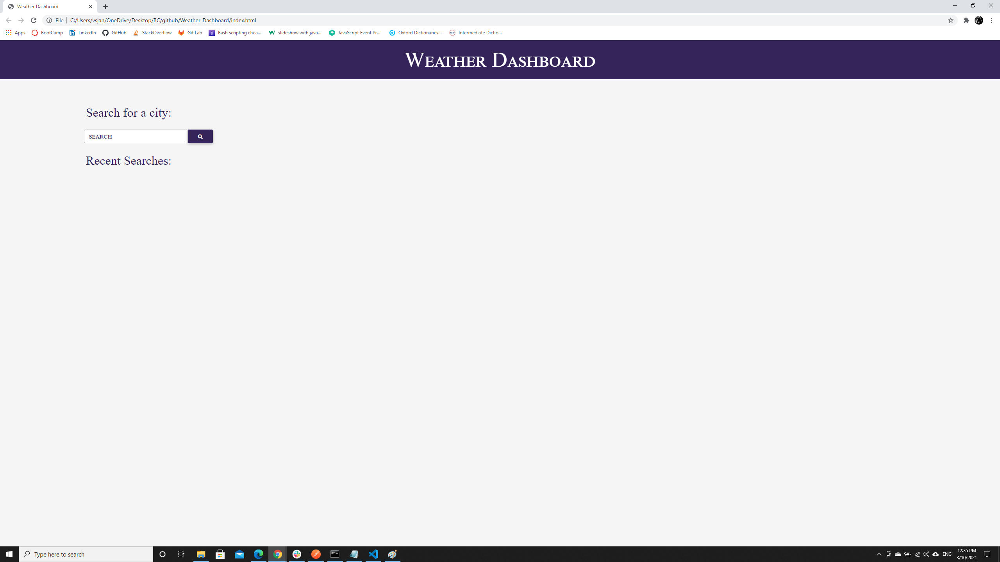
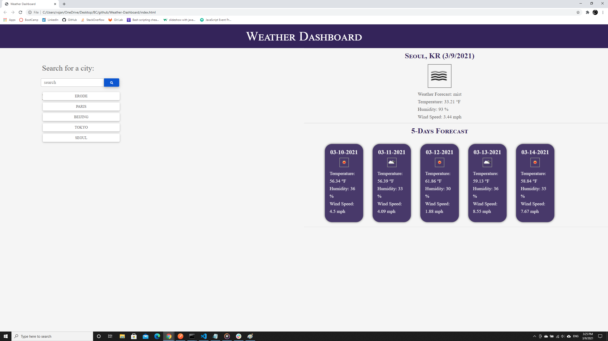

# Weather Dashboard

## Description
The weather dashboard helps you to search for daily weather and 5 day forecast of a city. The following formats can be used to search: 
1. city name (eg: San Fransisco)
2. city name,statecode (eg: Newark,ca)
3. city name,statecode,countrycode (eg: Newark,ca,us)

Please use ISO 3166 country codes for better results. if you get 404 not found error, try refining the search input. Last 5 searches are saved in local storage and displayed as button.

## Live URL
Please find the website deployed here - [(https://vsjanarthani.github.io/weather-dashboard/)]

## Built With
* HTML
* CSS
* JavaScript

## Data Source
* https://openweathermap.org/api

## Screenshot of the Deployed Webpage

## Contribution
Made with :heart: by **Janarthani V Subramaniam**