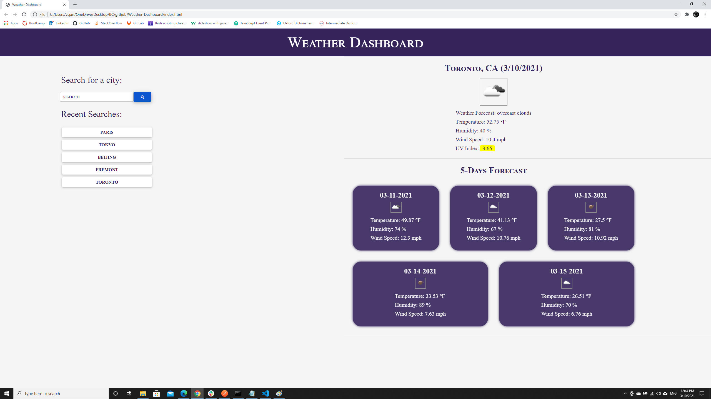

# Weather Dashboard

## Description
The weather dashboard webpage helps you to search for current weather and also 5 day forecast of a city. The following formats can be used to search: 
1. city name (eg: Union City)
2. city name,statecode (eg: Union City,ca)
3. city name,statecode,countrycode (eg: Union City,ca,us)

Please use ISO 3166 country codes for better results. Dont use spaces after comma. If you get 404 not found error, try refining the search to match the above mentioned formats. Last 5 searches are saved in local storage and displayed as button.

## Live URL
Please find the website deployed here - [(https://vsjanarthani.github.io/weather-dashboard/)]

## Built With
* HTML
* CSS
* JavaScript

## Data Source
* https://openweathermap.org/api

## Screenshot of the Deployed Webpage

## Contribution
Made with :heart: by **Janarthani V Subramaniam**